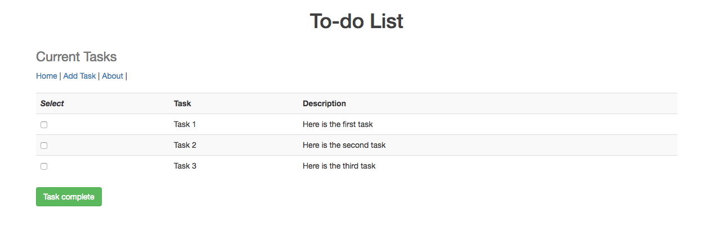
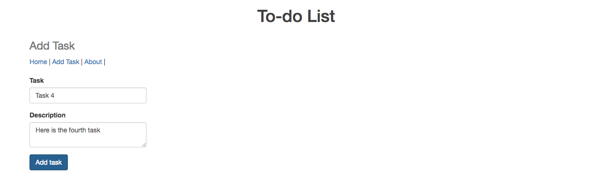
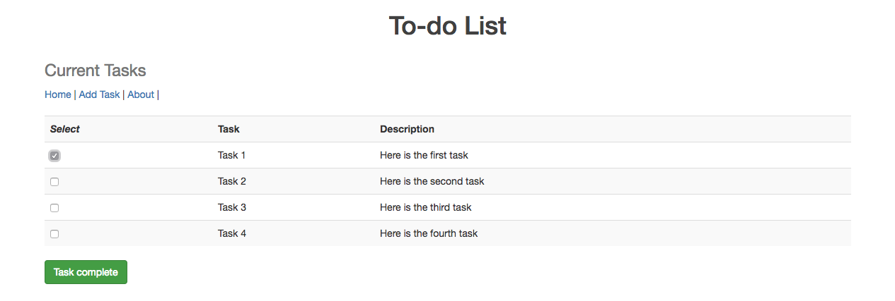
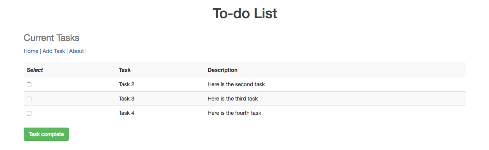

# todo-list
A simple persistence app to practice basic MVC procedures with database integration.

Add a task with a short description:

Select task(s) that have been completed:

Home page is updated to reflect remaining tasks only:

